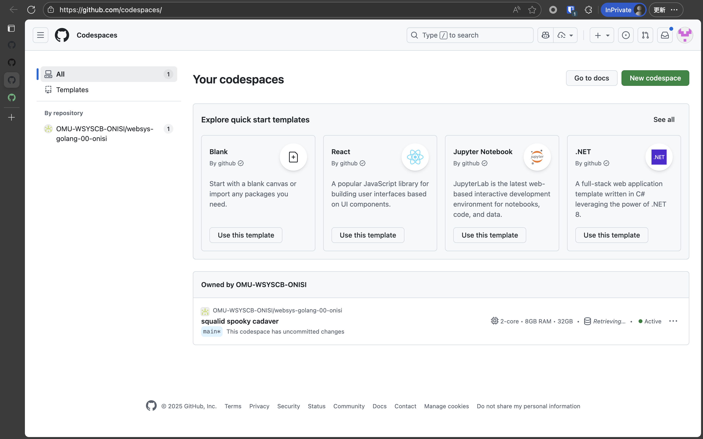
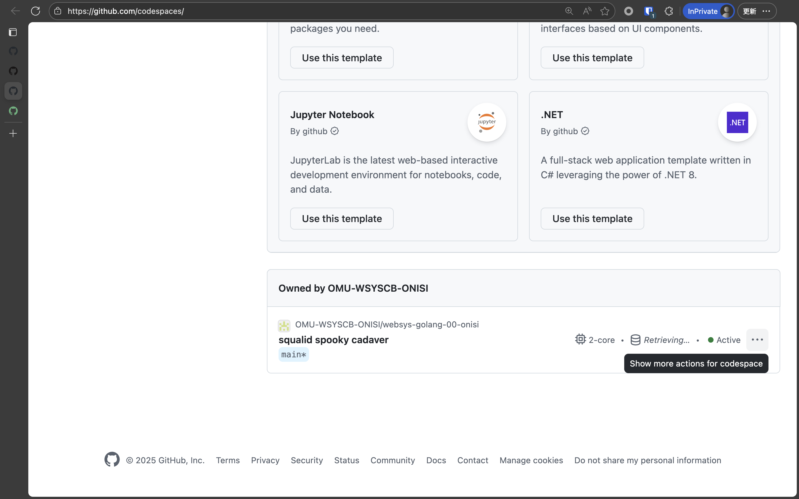
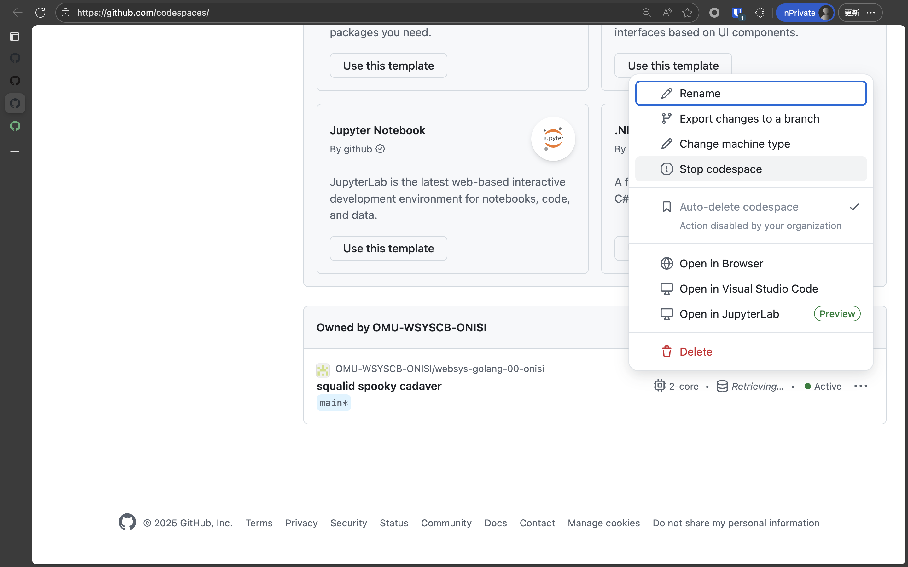
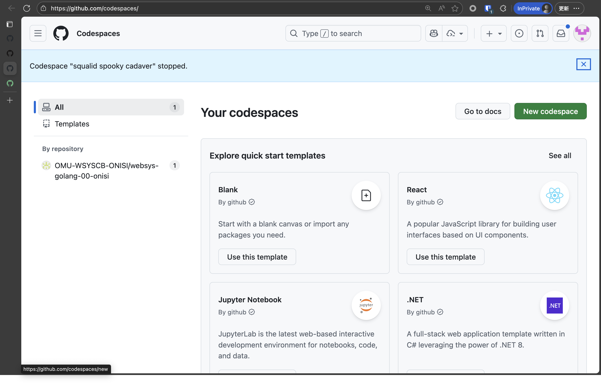
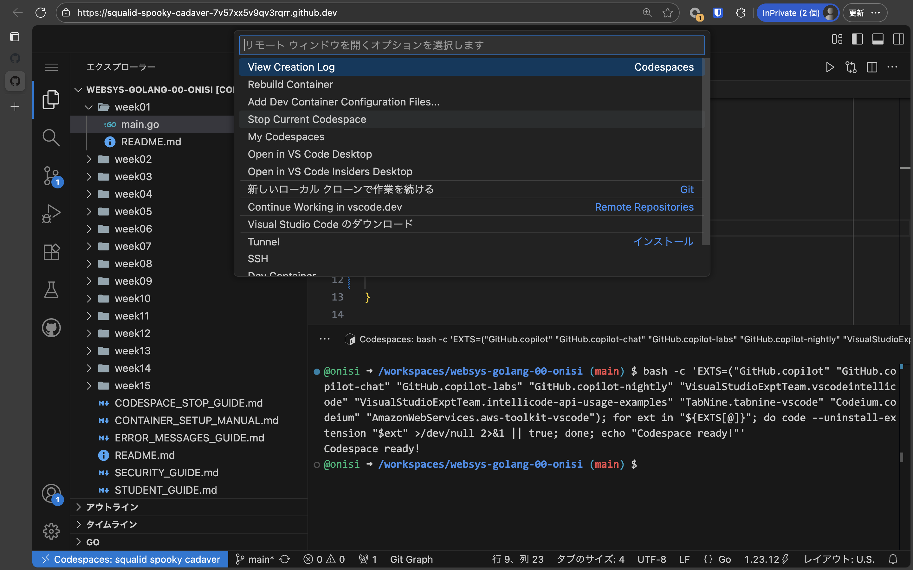
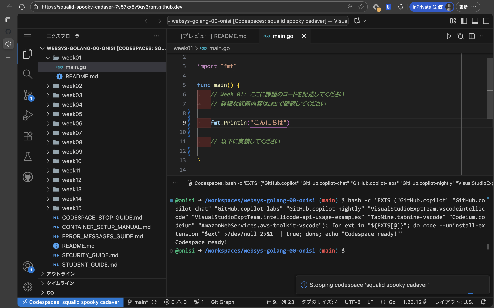
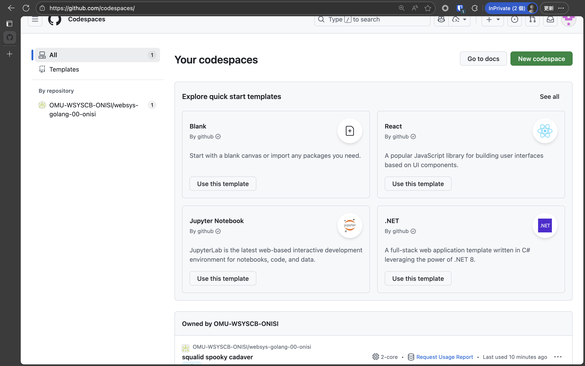

# Codespace停止ガイド（学生向け）
## なぜ停止が重要なのか・停止方法

## ⚠️ 必ず読んでください

**Codespaceは作業終了後、必ず停止してください。**

停止しないと、使用時間が消費され続けます。

---

## 💰 無料枠について

### この授業での無料枠（Student Pack取得済み）

**全員がGitHub Student Developer Packを取得済みです**:

- **月180コア時間無料**
- 2コアマシン使用時：**90時間/月**
- 4コアマシン使用時：45時間/月
- 15GBストレージ無料

**参考**: 
- [GitHub Student Developer Pack](https://education.github.com/pack)
- [GitHub Education for Students](https://docs.github.com/ja/education/about-github-education/github-education-for-students/about-github-education-for-students)

### 1日あたりの目安

```
90時間 ÷ 30日 = 1日あたり3時間

この授業での使用:
- 授業中: 約1時間/週
- 課題作業: 約2-3時間/週

合計: 週3-4時間程度
月12-16時間程度

→ 停止を忘れなければ十分足ります
```

### 停止を忘れると

```
例：停止せずに24時間放置（2コアマシン）

24時間 × 2コア = 48コア時間/日
48コア時間 × 30日 = 1,440コア時間/月

→ 無料枠（180コア時間）を大幅に超過
→ 追加料金が発生

たった2日で無料枠の半分以上を消費します！
```

**重要**: 必ず作業終了後は停止してください！

---

## 🛑 停止のタイミング

### 必ず停止すべき時

- ✅ **課題が完成して提出した後（最重要）**
- ✅ その日の作業を終える時
- ✅ 他の授業に移る時
- ✅ 昼休み・休憩（30分以上離席）
- ✅ PCをシャットダウンする前

### 停止しなくてもよい時

- 短時間（5-10分）の休憩
- 同じ作業セッション内での移動

### 自動停止について

- Codespaceは**30分間非アクティブ**で自動停止します
- ただし、**手動で停止する習慣をつけましょう**
- ブラウザを開いたままだと非アクティブにならない場合があります
- **30分待つより、すぐに停止する方が確実です**

### Codespace数の制限

- **1人あたり最大2個**のCodespaceまで作成可能
- この授業では**1個のCodespaceを学期を通じて使用**
- 複数作成すると無料枠を無駄に消費します
- 不要なCodespaceは削除してください

### 保持期間

- 使用していないCodespaceは**30日後に自動削除**されます
- 削除されてもリポジトリのコードは残ります
- 必要に応じて新しいCodespaceを作成できます

---

## 🔧 停止方法（3つ）

### 方法A: ブラウザから停止（推奨・最も簡単）

#### ステップ1: GitHub　Codespacesページを開く

- ブックマークしたリポジトリURLもしくは以下にアクセス
  ```
  例: https://github.com/codespace
  ```


#### ステップ2: Codespaceを停止

1. 実行中のCodespaceを探す
   - 緑色の「●」マークが表示されている
   - または「Active」と表示



2. 右側の「**...**」（3点メニュー）をクリック
3. 「**Stop codespace**」を選択



#### ステップ3: 停止を確認

- Codespaceのステータスが「**Stopped**」になっていることを確認
- 緑色の「●」が消えている



**所要時間**: 約10秒

---

### 方法B: Codespaces内から停止

#### ステップ1: コマンドパレットを開く

- Codespace画面で `Ctrl+Shift+P`（Mac: `Cmd+Shift+P`）

#### ステップ2: 停止コマンドを実行

1. 「**Codespaces: Stop Current Codespace**」と入力
2. 候補から選択してEnter



#### ステップ3: 確認

- 画面が閉じるまで待つ
- GitHubで停止を確認（方法A参照）



**所要時間**: 約5秒

---

### 方法C: メニューから停止

#### ステップ1: メニューを開く

- Codespaces画面の右上にある「≡」（3本線）メニューをクリック

#### ステップ2: 停止を実行

1. 「**MyCodespaces**」を選択


#### ステップ3: 確認

- GitHubで停止させる（方法A参照）

**推奨**: 方法Aが最も確実で簡単です

---

## 🔄 次回の作業開始

### 停止したCodespaceの再開

**前回の状態がそのまま残ります**

1. リポジトリの「Code」→「Codespaces」タブ
2. 停止中のCodespace（「Stopped」）から「Open in Browser」を選択
3. 約**3秒で再開**
4. 前回のファイル・ディレクトリがそのまま残っている

### 新規作成は不要

- 停止したCodespaceを再利用できます
- 毎回新規作成すると無駄にストレージを消費します
- **1つのCodespaceを学期を通じて使用**

---

## ✅ 毎回のチェックリスト

### 作業終了時（必須）

```
□ 課題を提出した（ブランチ名をLMSで報告）
□ ファイルを保存した（Ctrl+S）
□ Codespaceを停止した
□ 停止を確認した（Stopped表示）
```

### 推奨習慣

```
1. 課題提出後すぐに停止
   提出 → 停止 （セットで覚える）

2. 毎回停止を確認
   GitHubで「Stopped」表示を確認

3. 次回は同じCodespaceを再開
   「Create codespace」ではなく既存を選択
```

---

## 📊 使用時間の確認方法

### GitHub設定で確認

1. GitHub右上のプロフィールアイコンをクリック
2. 「**Settings**」を選択
3. 左側メニューの「**Billing and plans**」
4. 「**Codespaces**」セクションで使用時間を確認

### 確認すべき情報

- **今月の使用時間** (Core hours used this month)
- **残り無料時間** (Remaining free hours)
- **実行中のCodespaces数** (Active Codespaces)

### 定期的にチェック

```
推奨チェックタイミング:
- 月初め（1日）
- 月の中旬（15日）
- 月末（25日頃）

無料枠の50%以上使用している場合:
- 停止を徹底
- 不要なCodespaceを削除
- 使用時間を短縮
```

---

## ❓ よくある質問

### Q1: 停止を忘れてしまいました

**A**: すぐに停止してください

```
1. GitHubのリポジトリページを開く
2. 「Code」→「Codespaces」
3. 実行中のCodespaceを停止

次回から忘れないように、
課題提出後すぐに停止する習慣をつけましょう。

提出 → 停止 をセットで覚える
```

### Q2: 停止すると作業内容が消えますか？

**A**: いいえ、消えません

```
停止 = 一時停止（パソコンをスリープするようなもの）

- ファイルはすべて保存されます
- 次回再開時に同じ状態から始められます
- 編集中のファイルもそのまま
- 安心して停止してください
```

### Q3: 複数のCodespaceが実行中です

**A**: すべて停止してください

```
同時に複数実行していると、
使用時間が倍速・三倍速で消費されます。

対処方法:
1. 「Code」→「Codespaces」タブ
2. すべての実行中Codespaceを停止
3. 使っていないCodespaceは削除

この授業では1個だけ使用します。
```



### Q4: 自動停止に頼ってもいいですか？

**A**: 推奨しません

```
自動停止の問題点:
- 30分間待つ必要がある
- ブラウザを開いたままだと非アクティブにならない
- その間、課金され続ける

推奨:
- 作業終了後すぐに手動停止
- 30分待つより10秒で停止する方が確実
```

### Q5: 停止と削除の違いは？

**A**: 停止は一時停止、削除は完全削除

| 操作 | 停止 (Stop) | 削除 (Delete) |
|------|------------|--------------|
| ファイル | 保持される | 消える |
| 再開 | 可能（3秒） | 不可能 |
| 使用時間 | 消費停止 | 消費停止 |
| 推奨 | ✅ | ❌ |

**重要**: 
- 通常は「停止」を使用
- 削除はしないでください
- 削除すると全ファイルが消えます

### Q6: 無料枠を超えたらどうなりますか？

**A**: Codespacesが使用できなくなります

```
無料枠超過後:
- 新しいCodespaceを起動できない
- 既存のCodespaceも起動できない
- 翌月1日まで使用不可

対策:
- 停止を徹底する
- 使用時間を定期的に確認
- 計画的に使用する

停止を習慣化すれば無料枠内で十分です。
```

### Q7: 停止を確認する方法は？

**A**: GitHubで確認してください

```
確認方法:
1. リポジトリの「Code」→「Codespaces」
2. Codespaceのステータスを確認

停止している場合:
- 「Stopped」と表示
- 緑色の●マークが消えている
- 「Active」表示がない

実行中の場合:
- 緑色の●マーク
- 「Active」と表示
→ すぐに停止してください
```

### Q8: どれくらいの頻度で確認すべきですか？

**A**: 毎回の作業後に確認してください

```
推奨確認タイミング:
1. 課題提出直後（必須）
2. その日の作業終了時（必須）
3. 週1回（習慣として）
4. 月初め・中旬・月末（使用時間確認）

確認内容:
- Codespaceが停止しているか
- 今月の使用時間
- 実行中のCodespaces数
```

---

## 📝 まとめ

### 3つの重要ポイント

```
1. 作業終了後は必ず停止
   - 課題提出後すぐに停止
   - 提出と停止をセットで覚える
   
2. 停止を確認する
   - GitHubで「Stopped」表示を確認
   - 緑色の●マークが消えているか確認
   
3. 次回は再開する
   - 新規作成ではなく、既存Codespaceを再開
   - 約3秒で起動
```

### 停止の習慣化

```
作業フロー:

編集 → 実行 → 提出 → 停止
                    ↑
                  忘れずに！
                  
提出と停止はセット
```

### 無料枠管理

```
月90時間の無料枠（2コアマシン）

停止を徹底すれば:
- 週3-4時間の使用
- 月12-16時間
- 無料枠内で十分

停止を忘れると:
- 1日で48時間消費
- 2日で無料枠の半分以上
- すぐに使い切る
```

### 困ったら

- 教員またはTAに相談
- GitHub設定で使用時間を確認
- このガイドを再確認

---

**停止を習慣化して、無料枠内で快適に開発しましょう！**

**最重要**: 課題提出後すぐに停止 ⚠️


